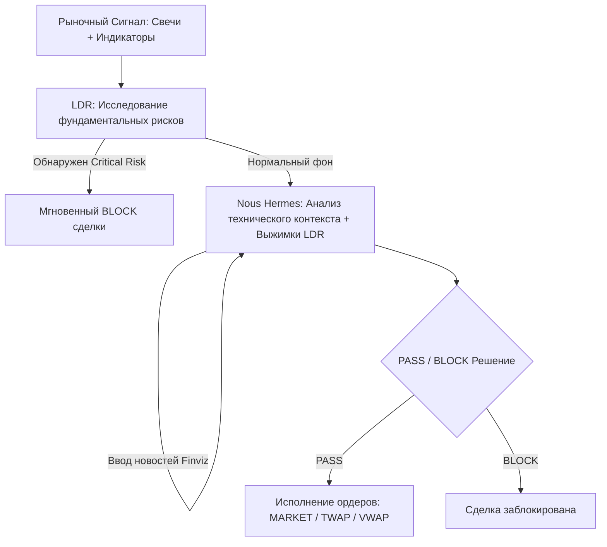

# 🛸 Cyber-Quant Signal Bot: Платформа Институционального Алгоритмического Трейдинга и ИИ-Анализа

**Cyber-Quant Signal Bot** — это передовая квантовая No-Code/Low-Code экосистема и визуальный конструктор торговых стратегий (Strategy Builder). Она создана для проектирования, бэктестирования, эволюционной оптимизации и автоматического исполнения высокочастотных торговых алгоритмов в реальном времени. 

Платформа стирает границы между криптовалютными активами и традиционным фондовым рынком, объединяя классический технический анализ, концепты Smart Money (SMC), анализ микроструктуры стакана (Order Flow), двустороннюю синхронизацию с TradingView и распределенный интеллект ИИ-агентов нового поколения (Nous Hermes, Heym MCP, LDR).

---

## 🧭 1. Интерактивный Холст Стратегий (Strategy Canvas)

Основой интерфейса является бесконечный интерактивный холст на базе **ReactFlow**, позволяющий пользователям собирать торговые алгоритмы из функциональных блоков (нод), настраивать их параметры «на лету» (Inline Parameters) и визуализировать потоки данных. Интерфейс полностью адаптирован для международной аудитории с помощью динамической системы локализации **`useLanguageStore` (100% двуязычный: RU/EN)**.

### Полная библиотека из 22+ функциональных нод:

#### 📥 Входные данные и коннекторы (Exchange & Feeds)
1. **Exchange Connector:** Подключение к биржам (Binance, Bybit, OKX, MEXC, Kraken и др.) через CCXT. Получение свечей (OHLCV) и данных стакана в реальном времени.
2. **Scanner (Скринеры):** Сканеры резких изменений объемов, всплесков волатильности и аномальной активности в стаканах.
3. **Polymarket Whales Scanner:** Отслеживание ставок институциональных китов на рынках предсказаний для выявления скрытых инсайдерских смещений.
4. **User Level Node:** Позволяет трейдеру вручную чертить уровни цен прямо на интерактивном графике, мгновенно передавая значения в логику графа.

#### 📈 Технический анализ и математика (Technical & Divergence)
5. **Indicators Node:** Полный набор классических индикаторов (RSI, MACD, Bollinger Bands, ATR, SMA/EMA, Stochastic) с расчетом на лету.
6. **Divergence Node:** Автоматическое обнаружение бычьих/медвежьих дивергенций между ценой и осцилляторами (RSI, MACD).
7. **MTF (Multi-Timeframe):** Анализ старших таймфреймов для фильтрации сделок младшего порядка (например, тренд на 4H фильтрует входы на 5M).
8. **Logic Node (AND/OR/NOT):** Булева алгебра для объединения и ветвления сигналов от разных индикаторов.
9. **Math Expression:** Математический калькулятор выражений для сравнения динамических переменных (например: `EMA(20) + 2 * ATR(14) > Bollinger_Upper`).

#### 🏛 SMC (Smart Money Concepts)
10. **Fair Value Gap (FVG):** Поиск зон ценового дисбаланса (имбалансов) и их частичного/полного перекрытия (Mitigation).
11. **Order Block (OB):** Идентификация зон институционального спроса и предложения (последняя нисходящая свеча перед сильным импульсом вверх и наоборот).
12. **BOS/CHoCH:** Отслеживание сломов структуры рынка (Break of Structure) и характера движения цены (Change of Character).
13. **Liquidity Sweep:** Обнаружение манипуляций крупного капитала — снятие пулов ликвидности за локальными экстремумами (свипы).
14. **Daily Bias & Killzones:** Фильтрация сделок по торговым сессиям (Азия, Лондон, Нью-Йорк) и дневному рыночному смещению.

#### 📊 Order Flow & Microstructure (Поток ордеров и стакан)
15. **Volume Delta / CVD:** Анализ рыночных покупок/продаж, расчет кумулятивной дельты объемов для выявления скрытых покупок/распродаж.
16. **Orderbook (Wall Distance):** Сканирование глубины стакана, расчет расстояния до крупных лимитных плотностей («плит») для выставления стопов и тейков.
17. **Deribit Put/Call Ratio (PCR):** Оценка сантимента рынка опционов.

#### 🧠 ИИ-Агенты и Внешний Интеллект (AI Cognitive Layer)
18. **Hermes Agent Node:** Интеграция Nous Hermes LLM в качестве умного риск-фильтра. ИИ анализирует весь текстовый контекст рынка и выдает решение `PASS` или `BLOCK` с Confidence Score.
19. **LDR Research Node (Local Deep Research):** Запуск фонового фундаментального ИИ-исследования актива. Сканирует СМИ, социальные сети и новости, формируя отчет с оценкой уровней риска от `low` до `critical`.
20. **heym MCP Node (Workflow Gate):** Интеграция с платформой `sim.ai` (Heym). Позволяет отправлять параметры сигналов в визуально спроектированные ИИ-цепочки для финальной валидации.
21. **Finviz Stock Screener Node:** Сканер акций фондового рынка США по тонким фильтрам (капитализация, цена, объем, P/E).

#### 💸 Исполнение и Риск-менеджмент (Execution Layer)
22. **Trade Action:** Выставление Market/Limit ордеров, настройка динамических или фиксированных объемов позиций.
23. **Smart Grid Manager:** Автоматическая сеточная торговля (арифметическая или геометрическая) с адаптивным шагом между ордерами.

---

## ⚡ 2. Глубокие Системные Интеграции и Мосты

Проект объединяет три независимых решения (`signal-bot`, `sim-main` и `tradingview-mcp`) в единую высокоэффективную торговую среду:

### 🔌 Интеграция с `sim-main` (Heym MCP Platform)
*   **ИИ-Валидатор сигналов (`validateSignal`):** Бэкенд-служба `HeymMcpService` перенаправляет сработавшие сигналы в визуально спроектированный ИИ-сценарий (workflow) в Heym на порту `4017`. ИИ производит когнитивную оценку внешних данных и выдает структурированное решение `PASS`/`BLOCK` с указанием аргументов.
*   **Динамический импорт MCP-инструментов:** Автоматическое обнаружение пользовательских воркфлоу Heym через эндпоинт `/mcp/tools` с возможностью вызова их как функциональных инструментов прямо внутри бэкенда `signal-bot`.

### 📉 Интеграция с `tradingview-mcp` и Инструментами Рисования
*   **Двусторонний Zustand-мост (`useChartSyncStore`):** Интерактивная синхронизация графиков Lightweight Charts с холстом ReactFlow. Любой перетащенный трейдером уровень `User Level` на графике мгновенно обновляет параметры соответствующей ноды на холсте без задержек.
*   **PineScript Importer v2 (`pineParser.ts`):** Встроенный фронтенд-компилятор PineScript. Позволяет вставить любой исходный код индикатора TradingView v5, автоматически разобрать его логику (условия, пороги, AND/OR пересечения) и мгновенно сгенерировать готовую визуальную сеть нод на холсте.

---

## 🛡️ 3. Институциональный Модуль Исполнения Ордеров

Бэкенд платформы оптимизирован под жесткие требования к надежности и скорости проведения транзакций:

*   **ccxt-queue (Bull Queue + Redis):** Очередь исполнения ордеров по алгоритму FIFO с жестким лимитированием частоты запросов (rate limiter: до 5 req/sec). Гарантирует защиту API-ключей от блокировок бирж (HTTP 429).
*   **Алгоритмы исполнения TWAP и VWAP:** Интегрированные алгоритмы частичного заполнения крупных заявок во времени (TWAP) или на основе объемов (VWAP) как для реального/бумажного трейдинга, так и в системе бэктестирования, что сводит проскальзывание (Slippage) к минимуму.
*   **Серверные Bracket Orders (OCO):** Модуль `OcoManagerService` связывает Take-Profit и Stop-Loss ордера через WebSockets. При исполнении одного из них биржевой фид мгновенно триггерит отмену сервером противоположной заявки. Резервный REST-поллинг (каждые 30 сек) обеспечивает дополнительную безопасность на случай обрыва WebSocket-соединения.
*   **atr-grid (Адаптивные сетки):** Динамический расчет шага сетки ордеров на основе текущей волатильности (ATR). Сетка сжимается на спокойном рынке и автоматически расширяется во время штормов, защищая капитал от «проскальзывания».

---

## 🔬 4. Среда Отладки и Эволюционной Оптимизации

*   **Визуальный Отладчик (Execution Trail Debugger):** Система трассировки выполнения графа. При активации режима **Debug** неиспользуемые ветви логики тускнеют, а отработавшие блоки и прибыльные маршруты подсвечиваются ярким неоновым свечением (`green` — логика пройдена, `red` — условие не выполнено).
*   **BFS-Валидатор связей графа:** Алгоритм поиска в ширину (BFS) проверяет граф перед запуском. Ноды, оторванные от источников данных или имеющие некорректные соединения, автоматически деактивируются и подсвечиваются серым цветом для предотвращения сбоев.
*   **Генетический оптимизатор параметров (`OptimizerService`):** Эволюционный алгоритм, подбирающий числовые переменные нод (периоды RSI, EMA, пороги) путем симуляции сотен комбинаций в бэктест-системе. По результатам оптимизации выводится сравнительная таблица с метриками доходности, коэффициента Шарпа, количества сделок и фактора восстановления с возможностью мгновенного применения лучших параметров на холст.

---

## 🧠 5. Трёхслойная Когнитивная Синергия ИИ (AI Analytics Suite)

Платформа представляет собой первую No-Code среду, где ИИ является полноценным участником торгового пайплайна:

1.  **LDR (Knowledge Layer):** Микросервис глубоких исследований сканирует СМИ, социальные сети и новости актива. При обнаружении критических угроз (взломы, судебные иски) сделка блокируется мгновенно без обращения к дорогостоящим LLM.
2.  **Nous Hermes (Cognitive Layer):** Бэкенд-служба `HermesService` отправляет ИИ-агенту структурированный массив данных (свечи, показатели индикаторов, дельта стакана, объемы) и выжимки LDR для принятия логического решения о входе. Решения кэшируются в Redis (TTL 10 минут) для экономии ресурсов.
3.  **Finviz Stock Intel:** При торговле акциями в контекст ИИ-агента автоматически подтягиваются и анализируются новостные заголовки Finviz для учета текущего новостного сентимента.

---

## 🔌 6. Автономное развертывание (Fleet & Codegen)

*   **Codegen Service:** Любая стратегия, созданная пользователем на холсте, может быть скомпилирована одной кнопкой в независимый, чистый Python-код.
*   **FastAPI + Docker Containerization:** Сгенерированный код упаковывается в ультра-легкий Docker-контейнер, содержащий FastAPI-сервер, watchdog-систему слежения за соединениями и интеграцию с Telegram-уведомлениями. Трейдер может развернуть сотни таких контейнеров на удаленном VPS, управляя ими через единую панель **Fleet Management** с кнопкой экстренного останова **Panic Stop**.

---

## 🛠️ 7. Технологический стек

*   **Frontend:** React 18, TypeScript, Vite, Zustand, ReactFlow 11, Lightweight Charts (by TradingView), Lucide-React.
*   **Backend:** Node.js (NestJS / Express), Redis (кэширование, очереди Bull, Pub/Sub), PostgreSQL, TypeORM, CCXT.
*   **AI Layer:** Flask, Ollama, HuggingFace, Nous Hermes LLM, Heym (sim-main).
*   **Infrastructure:** Docker, Docker Compose, GitHub Actions CI/CD.
